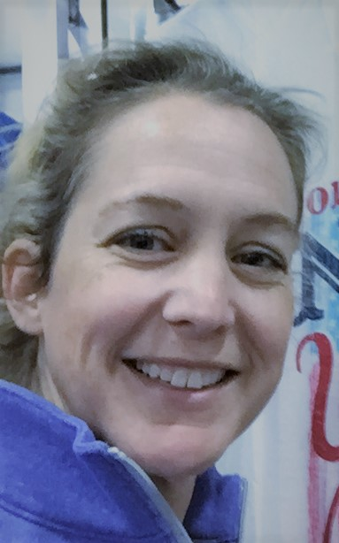

# My Portfolio

I was asked to create a website to be my landing page for employers to look for my projects that I have completed.  This was to include links to sections of "About Me", "Work", and "Contact Me."  I was also to provide a link to any of the web pages I have completed.

## Getting Started

I started by reading through the homework requirements.  I then used a pen and a piece of paper to sketch out how I wanted my page to look.  I then figured out what I was going to say and where it needed to be located.  I used pictures from my iPhone for filler spots where my future projects will go.  I used an image off a Google search of computer code to represent the first boot camp project that I completed.  After many hours of searching, I was able to get the layout to work the way I wanted it to.  Then I was able to locate on Stack Overflow how to link the links at the top of my page to the sections they corresponded with and also how to link my picture with the actual website of my first project, because that was something I was having problems with.  Finally, I was able to launch my website.  For some reason the actual pictures are not working.  They included:




### Prerequisites

I needed to have Google Chrome, Visual Studio Code, GitHub and GitBash to run this program.

```
I used Google Chrome to look at my website.  I used Visual Studio Code to type the CSS and HTML code.  I used GitBash to upload the files to GitHub.  I used GitHub to launch the website.
```

### Installing

T first step I took was looking at the assignment.

```
I needed to know the prerequisites to be able to narrow down my focus of my project.
```

Then I sketched out on paper how the website was going to look

```
I needed a visual example to see what the homework was asking for.
```
Then I did some research on how I could accomplish the website.

```
I jotted some notes down on how I needed to organize everything.
```
Then after trial and error and more research I was able to launch the website.


## Built With

* [HTML](https://developer.mozilla.org/en-US/docs/Web/HTML)
* [CSS](https://developer.mozilla.org/en-US/docs/Web/CSS)

## Deployed Link

* [See Live Site](https://lauryritter.github.io/My-portfolio/)


## Authors

* **Laury Ritter** 

- [Link to Portfolio Site](https://lauryritter.github.io/Lauryritter)
- [Link to Github](https://github.com/Lauryritter)
- [Link to LinkedIn](www.linkedin.com/in/laury-ritter-4a449921a)

## License

This project is licensed under the MIT License 

## Acknowledgments

* My instructure Jerome and the TAs at schhol who are very patient and do a great job rephrasing things so I can understand.
* W3schools.com for all their excellent resources.
* Stackoverflow.com for having a ready answer when I just can't figure things out.
* My boyfriend, Brian, for cheering me on even when I cry from frustration.